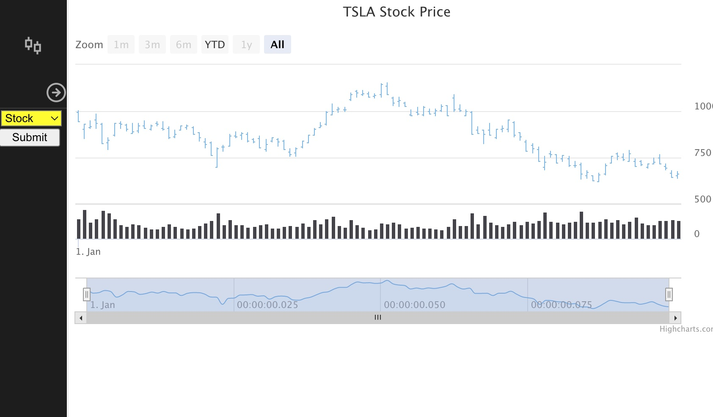
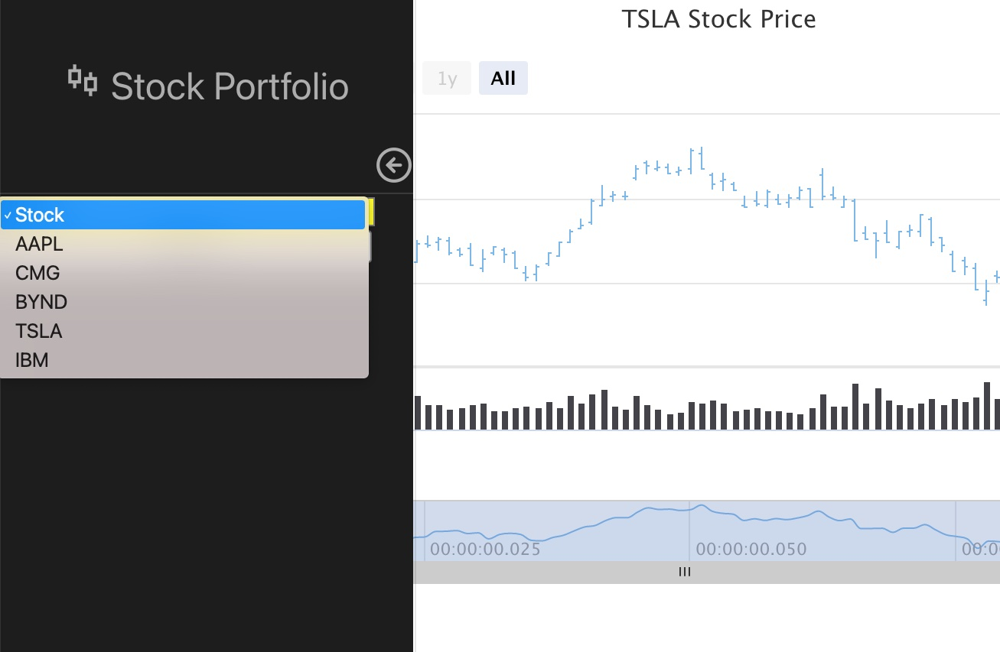

<h1 align="center">Stock Portfolio</h1>

This application displays stock data for 5 different companies. Upon page load, the user will see the default data for IBM. The user can change the chart data by using the select box on the side bar. The user can change the dispaly of the data by manipulating the scroll bar on the bottom of the chart. The user can view all of the metrics by hovering over the graph.

 

## Authors
- [Luke Wofford](https://github.com/woffordlm)

## Deployment

- [Github](https://github.com/woffordlm/gartnerDemo)

## Installation

After installing npm packages, type npm start and open your browser to localhost:3000.

 This application is meant to be run along side the gartner-demo server. Open up the server and type npm start into the command line.

- [Github/server](https://github.com/woffordlm/gartner-server)

## Explanation of this application's logic

The applications logic runs in the following sequence:

Simplified explanation:

When the user selects a stock symbol, the application makes a request to a server and expects back data for the stock that the user selected. The application then formats this data and displays it in the form of a chart. 

A Deeper Explanation

1. App.js renders and the app is then routed to the home component
2. Before the home jsx renders, a fetch request is sent to an endpoint on the gartner-server, the returned data is saved in state. The jsx renders and the data is passed on to the Chart component. 
3. The chart component is where the data in formatted so that it can be used with highcharts. Once fomatted, we save the appropriate parts within the stockOptions variable and this is passed on to the StockChart component. 
4. The stockChart component imports the HighChartsReact element and all of the data is passed into this element, which results in a chart being rendered on the screen using the appropriate data. 
5. The sidebar component has the abililty to change state and will trigger a rerender if a new search is made. If a new search is made, the updated state value triggers a new fetch that then results in a new chart. 
          

## Technologies

 

## License

